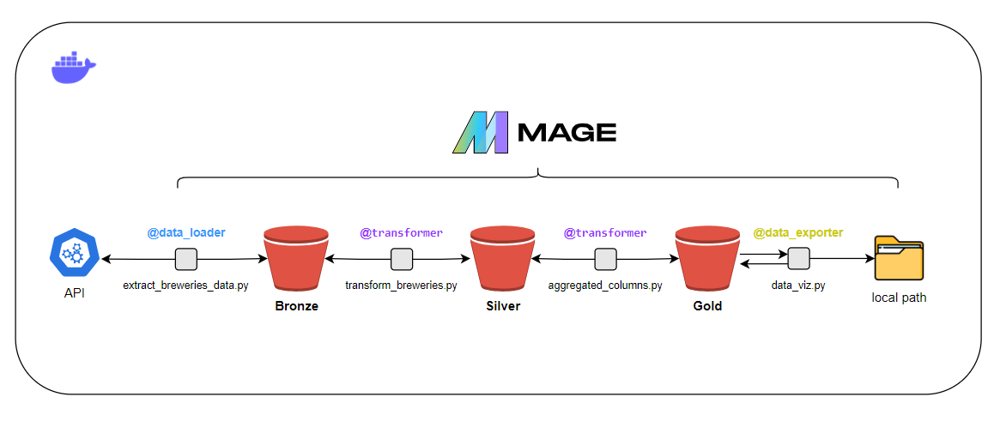
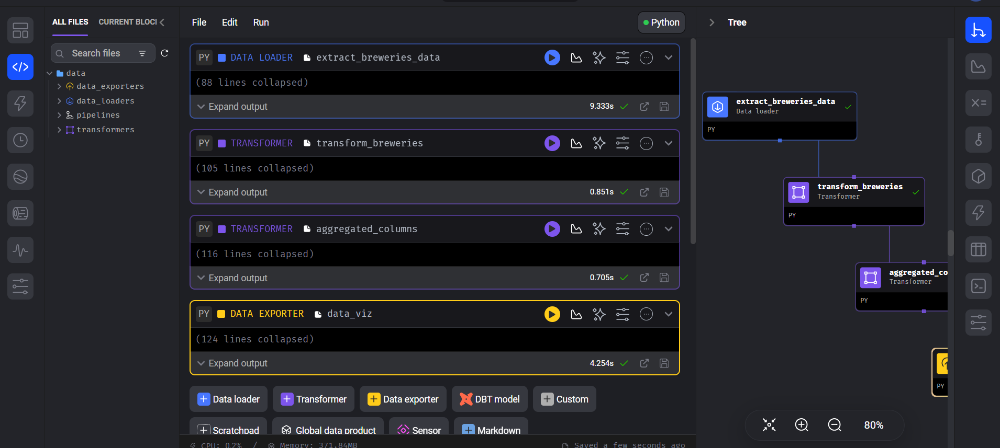
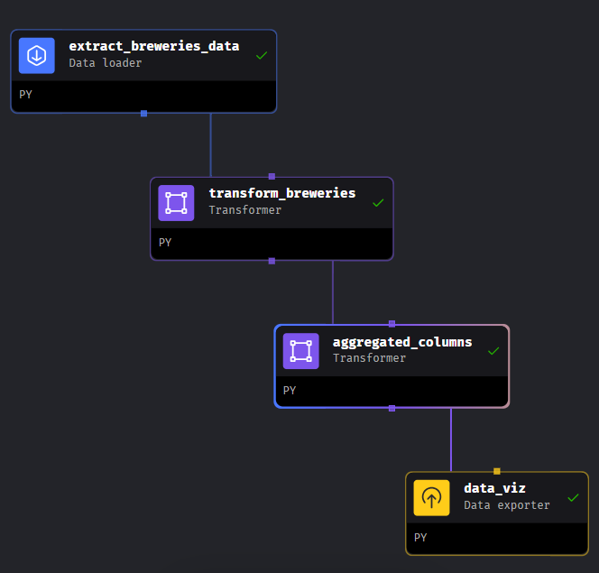
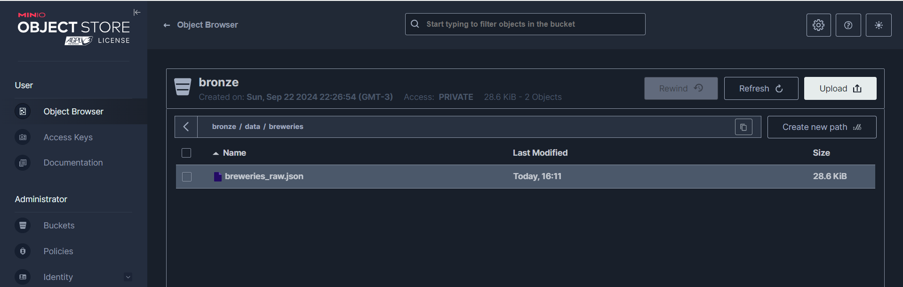
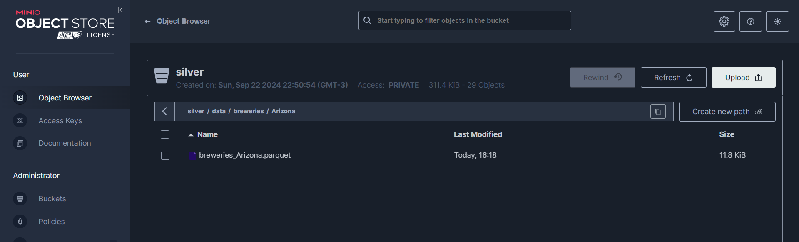
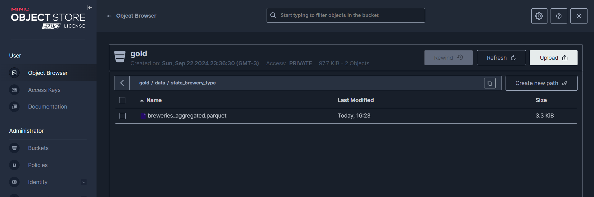
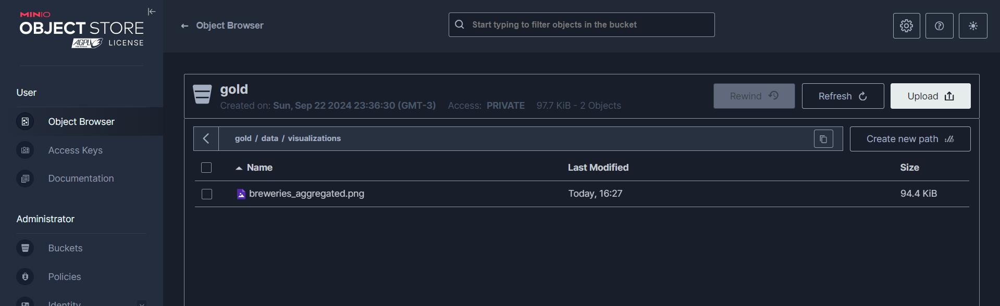
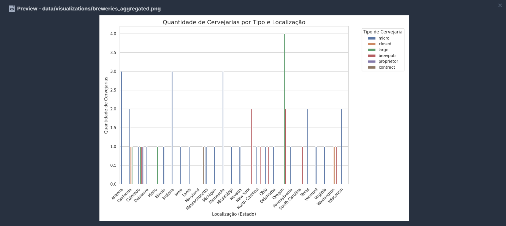
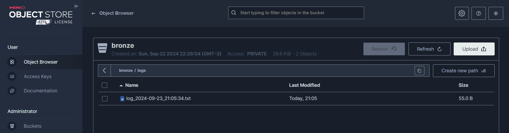
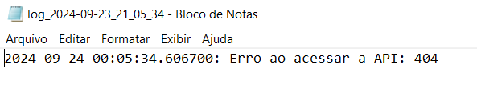

# breweries case(Data Pipeline)

### Introdução
O objetivo desse projeto é criar um pipeline consumindo dados de um API armazenando em um ambiente Data Lake seguindo a arquitetura Medallion com três camadas:
- **Bronze 🟤:** Dados Brutos.
- **Silver ⚪:** Dados selecionados e particionado por localização.
- **Gold 🟡:** Dados agredados para análise.
- **Extra 📊:** Visualização gráfica dos dados que estão na camada Gold.

### Feramentas utilizadas 
- **Python** - Linguagem escolhida para a extração e tratamento dos dados entre as camadas do nosso Data Lake.
- **Mage** - Orquestrador do nosso ambiente, nele podemos ter uma visão macro do nosso pipeline e trabalhar com blocos (data loader, transform, data exporter).
- **MinIO** - Repositório de dados (Tem o mesmo conceito que o AWS S3). Nele vamos criar nossas camadas do Data Lake que armazenarão os dados.
- **Docker** - Conteinerização do nosso ambiente, configurado em um *docker-compose.yml*.

## Arquitetura


## Pré Work
Caso queira ver o Pipeline funcionando, antes de clonar o repositório, tem algumas etapas de configuração: 
- Instalar Docker (Estou utilizando no linux).
- Instalar Python (Python 3.10.12 or more).
- Criar um arquivo *.env* para incluir as chaves de acesso do MinIO, evitando expor usuário e senha no código-fonte:
  ```bash
      # Definir o nome do usuário e senha que precisa conectar no serviço Web
      MINIO_ACCESS_KEY='<USER>'
      MINIO_SECRET_KEY='<SENHA>'
  ```
- Subir o ambiente:
  ```bash
      # Construir as imagens 
      docker-compose build

      # Subir o ambiente
      docker-compose up -d
  ```
- Acessar o Mage: ```http://localhost:6789/```
- Acessar o MinIO: ```http://localhost:9001/```

## Orquestração - Mage
Toda orquestração entre as camadas, desde o load até a visão agregada dos dados na camada Gold + a construção do gráfico está centralizada no Mage. Nele podemos visualizar a árvore dos blocos que utilizamos para o tratamento dos dados. Além de executar blocos específicos ou o pipeline todo.

 
 
🌳 Árvore dos blocos 🌳:



## Extração - Bronze
Para a extração, foi criado um script python utilizando o bloco Data Loader do Mage [extract_breweries_data.py](data/data_loaders/extract_breweries_data.py) no qual captura os dados da API e armazena na camada Bronze no MinIO. O script salva os dados em um arquivo JSON ```breweries_raw.json``` na partição ```bronze/data/breweries/```. Caso o bucket não tenha sido criado, o próprio script faz a criação:



## Transformação - Silver
O próximo passo é capturar os dados brutos que estão na camada Bronze, particioná-los por localização das cervejarias e salvar o resultado na camada Silver ```silver/data/breweries/<location>``` em um formato de armazenamento colunar. No caso utilizaremos o parquet, visando melhor economia no armazenamento, OLAP e desempenho dos dados.

O script [transform_breweries.py](data/transformers/transform_breweries.py) está utilizando o bloco Transformer do Mage


Aqui está um exemplo de como fica o arquivo nesta camada:




## Transformação - Gold
Por fim, o script [aggregated_columns.py](data/transformers/aggregated_columns.py) utilizando o bloco Transformer do Mage, pega os dados da camada Silver, valida se há os arquivos dentro das partições e se existe as colunas necessárias para criar uma visão agregada com a quantidade de cervejarias por tipo e localização. Salvando os dados na partição ```gold/data/state_brewery_type/``` no seguinte arquivo ```breweries_aggregated.parquet```.




## Disponibilização - Data viz
**Extra** - O pipeline conta com um bloco Data Exporte do Mage que contém o script [data_viz.py](data/data_exporters/data_viz.py), no qual captura o resultado da agregação na camada Gold e cria um gráfico utilizando as bibliotecas ```pyplot``` e ```seaborn```. O gráfico é armazenado tanto na camada Gold, mais precisamente na partição ```gold/data/visualizations```, como também salva em um diretório local ```./data/visualizations/breweries_aggregated.png```.



📊 Output do gráfico 📊:




## Logs
Caso ocorra algum erro no processo, os logs são armazenados também no bucket, mais precisamente na partição ```<camada>/logs```. Todas as camadas (Bronze, Silver e Gold) seguem o mesmo padrão.





## Monitoramento e Disponibilidade - Próximos Passos
Como um upgrade para este pipeline, podemos aproveitar os logs de erro (caso tenha) das etapas de extração e tratamento de dados, para criar um ambiente de monitoramento e disponibilidade dos dados.

Para isso, apresento algumas soluções:
-  **Zabbix** -  Aproveitar a liberdade que esta ferramenta tem de personalizar monitoramentos, criando triggers que captura o output dos logs das camadas. O monitoramento, por exemplo, pode gerar um alerta crítico replicando para algum serviço de mensageria (Telefone, Email, SMS, Slack e etc...)
- **Prometheus + Grafana** - Criar métricas personalizadas, configurando Prometheus para coletar dados de uso e performance diretamente das APIs MinIO (Ou APIs S3) e usar o Grafana para visualizações detalhadas, oferecendo uma visão clara das atividades nas camadas Bronze, Silver, e Gold.


